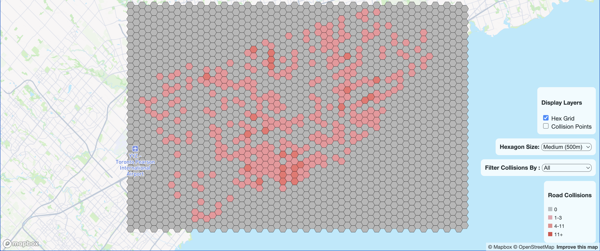
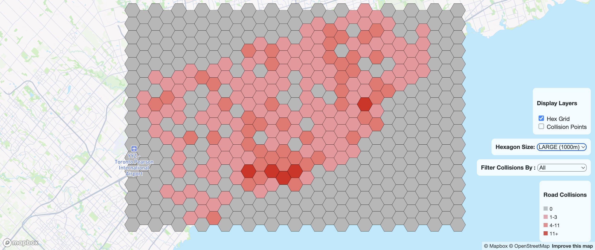

# Introduction

Welcome to **Analyzing Road Collisions in Toronto**! This map showcases where road collisions occurred
in Toronto that involved pedestrians or cyclists between 2006 and 2021.

---
# Libraries

This project has utilized the following libraries:

- Turf (GIS Analysis)
- Mapbox API (Map Rendering)
- Pandas (Calculating Class Bins)
---

# Datasets

```pedcyc_collision_06-21.geojson``` - All roadside collisions involving pedestrians or cyclists that occurred 
between 2006 and 2021.

---

# Files

Here are important files and their main purposes:

```determine_classification_values.py``` - Determines the bins for each class in the choropleth hex grid map.

```index.html``` - Handles webpage structure

```script.js``` - Handles the logic for the road collision map

---

# How to Use

On the map, Toronto is divided into 500m hexagons. Clicking on a hexagon displays a pop up explaining 
how many collisions occurred within that hexagon. Use the legend to determine which collision class the hexagon falls 
under to get a general sense of which regions oversaw more or less collisions relative to other regions. 

Click on an individual collision point to learn more about that particular collision. 

If the information on the map becomes overwhelming, you can always toggle layers on or off through the "Display Layers" 
user interface.

You can also filter the map by following types of road collisions: 
- ```All```, which shows all collisions on the map
- ```Alcohol Involved```, which shows collisions where alcohol intoxication was a factor
- ```Fatal```, which shows collisions that were fatal


### Bonus Feature! Fun with MAUP

The MAUP (Modifiable Areal Unit Problem) describes how the results of 
data aggregation into subdivisions can change based on the size and shape of the subdivision.
Inspired by MAUP, I created a hex size dropdown that lets one choose between ```Medium``` and
```Large``` hexagons. The ```Large``` hexagons have sides of 1000m in length whereas the medium 
hexagons have sides of 500m in length. The pictures below show how widely different the hex grid looks when
you change only one variable, the size of the hexagonal subdivisions:





---
# Credits

Created By Shawn Kapcan